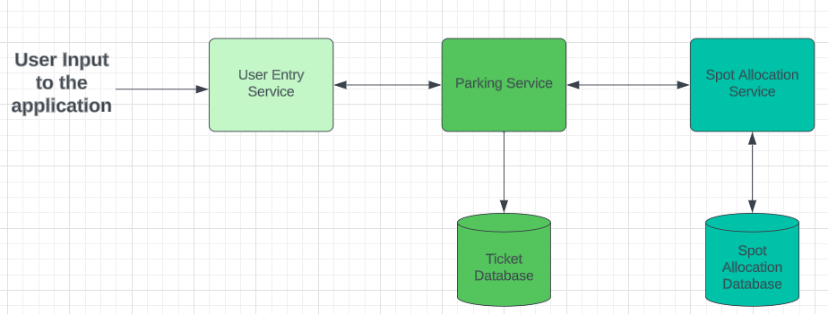

# parking-garage-microservice
Expanding my knowledge in microservices just wanted to create a parking garage microservice I took some inspiration from this [blog post](https://medium.com/double-pointer/system-design-interview-parking-lot-system-ff2c58167651) 

## how to start the application
There are 3 services (No UI yet):
- user-entry
- parking-service
- spot-allocation-service ( In development )
To start service navigate to the folder and the run the command:
```
./gradlew quarkusdev
```


### `user-entry` 
is the entry service user requests a ticket and this service passes the request off to the parking-service.

### `parking-service`
This service is responsible for taking the request made by the user-entry service, persist the ticket information as well as reach out to the spot allocation service to get a parking spot.
### `spot-allocation-service`
This service will take the request made from the `parking-service`, and find an available parking spot and send the spot back to the `parking-service` that will later be sent back to the client.

## Note:
This is kind of an overkill application but just want to demonstrate the microservice communication, how to test microservices and persistence.


# Learning Material (Not sponsored)
I will mention some resources that I used when learning this framework the author is `Antonio Goncalves` there is a great course I can recommend: 
- [Agoncal](https://www.udemy.com/share/105Cmy3@k_dxIuEXxuER_PeuIPTH63h8Qkr7bvN9p5g6dF0iwmX2lOukAeEU45C6nnbJpwPdbA==/)
- [Agnocal Personal Website](https://antoniogoncalves.org/)

# System Architecture Overview
